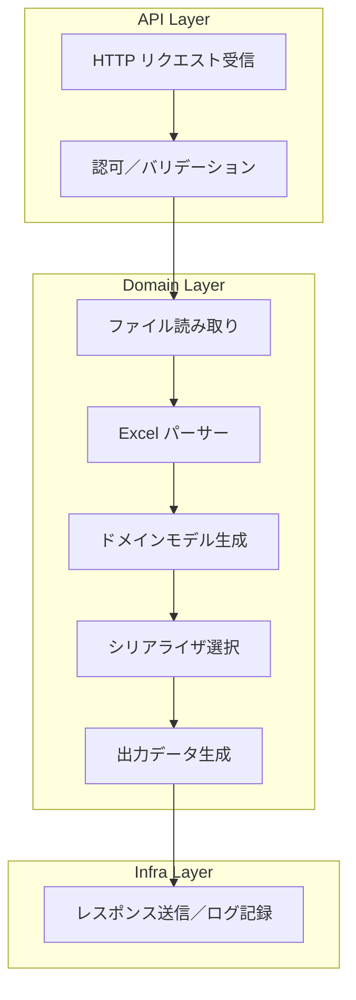

## 設計書: Excel → 可逆構造化データ変換システム （Rust / Web API）

---

### 1. 概要

- **目的**: Excel（.xlsx/.xls/.csv）のシート情報を、元データを損なわず可逆に変換可能なレベルで構造化データ（セル座標＋値＋数式＋メタ情報）として出力し、必要に応じて元Excelに復元できるようにする。
- **ターゲット環境**: バッチ処理前提、分間1リクエスト以下、200KB程度のファイル想定
- **エンドユーザー**: Web API経由でファイルをアップロードし、JSON/YAML/XML/SQLでダウンロード

---

### 2. 抽象設計



- **入力**: multipart/form-data により受け取る `file` と `format` パラメータ
- **出力**: リクエストされたフォーマットのデータ（JSON / YAML / XML / SQL）、またはエラー詳細（HTTP 500）
- **バッチ処理**: シーケンシャル実行が基本。将来的に大規模化した場合は、シート単位並列化（rayon）や非同期I/O（Tokio）のオプションを追加可能

---

### 3. ドメインモデル

```rust
/// ワークブック全体
struct Workbook {
    sheets: Vec<SheetMetadata>,       // シート順序＋可視性
    cells: Vec<CellData>,             // 空セル除外
    merged_ranges: Vec<MergedRange>,  // マージセル範囲
}

/// シート情報
struct SheetMetadata {
    name: String,   // シート名
    index: usize,   // 順序 (0-based)
    hidden: bool,   // 隠しシートフラグ
}

/// セル情報
struct CellData {
    sheet: String,         // シート名
    address: String,       // A1形式
    row: u32,              // 1-based
    col: u32,              // 1-based
    data_type: String,     // "String"/"Number"/"Boolean"/"Date" 等
    value: String,         // 値を文字列化
    formula: Option<String>,// 数式セルは原式を保持
}

/// マージセル範囲
struct MergedRange {
    sheet: String,
    start: String,         // 例: "B2"
    end: String,           // 例: "D4"
}
```

---

### 4. API設計

| メソッド | エンドポイント | パラメータ              | 説明                         |
|:--------|:--------------|:------------------------|:-----------------------------|
| POST    | `/convert`    | `file`:multipart<br>`format`:<br>`json`/`yaml`/`xml`/`sql` | Excel → 構造化データ変換  |

**成功応答** (例 JSON)
```json
{ "sheets":[...], "cells":[...], "merged_ranges":[...] }
```
**失敗応答**
- HTTP 500
```json
{ "error":"ParseError", "message":"シート '売上' のセル A1 読み取り失敗: 無効な数値", "details":[...] }
```

---

### 5. Axum vs Actix-web 比較

| 特徴                  | Axum                                      | Actix-web                                 |
|:----------------------|:------------------------------------------|:------------------------------------------|
| **設計思想**           | Tower/Tokioエコシステムに準拠<br>関数的・中間ウェア中心     | Actorモデルベース<br>高度に最適化されたエンジン    |
| **非同期ランタイム**    | Tokio                                   | Tokio (標準) / Actixランタイム選択不可           |
| **パフォーマンス**      | 高い（標準的なRust async性能）           | 非常に高い（ベンチマーク上、リクエスト処理QPSが上）|
| **学習コスト**         | シンプルだがTower理解が必要<br>型安全性重視         | 設定量多め。マクロ・Actor概念に慣れが必要          |
| **拡張性・エコシステム**| TowerエコシステムのMiddleware豊富         | WebSockets, SSE, SSE, gRPC対応例が豊富         |
| **エラーハンドリング**  | `Result`チェーン＋ `axum::Error` 型で一貫性   | `ResponseError`トレイトで汎用的               |
| **ユースケース適合度**  | シンプルなバッチAPI<br>軽量ミドルウェアで要件十分   | 高負荷環境や複雑ルーティング<br>大規模サービス   |

> **今回のケース**: 単一バッチAPI／分間1リクエスト以下・大規模負荷なし<br>→ ミドルウェア定義が直感的で導入コストが低い **Axum** を推奨

---

### 6. モジュール構成

```
src/
├── api/                  # Webフレームワーク層
│   └── handlers.rs       # Axum or Actix-web のルーティング＋バリデーション
├── parser/               # 入力ファイル読み取り
│   ├── excel_reader.rs   # calamine/.xls/.xlsx読み取り
│   └── csv_reader.rs     # csv入力対応
├── model/                # ドメインモデル定義
│   ├── workbook.rs
│   ├── sheet.rs
│   ├── cell.rs
│   └── merged_range.rs
├── transformer/          # フィルター・データ型正規化
│   └── normalize.rs
├── serializer/           # 出力フォーマット別実装
│   ├── json.rs
│   ├── yaml.rs
│   ├── xml.rs
│   └── sql.rs
└── util/                 # ログ(tracing), エラー定義
    └── logger.rs
```

---

### 7. 技術スタック

| 層             | クレート／技術         | 理由                                         |
|:---------------|:-----------------------|:---------------------------------------------|
| Web API        | **Axum**               | 軽量・型安全・導入コスト低                  |
| Excel読取      | calamine               | .xlsx/.xls対応                               |
| CSV読取        | csv                    | 入力CSV高速ストリーミング                    |
| シリアライザ   | serde_json/yaml + quick-xml | 多フォーマット対応                         |
| ロギング       | tracing                | 構造化ログ                                   |
| テスト         | tokio-test + insta     | 単体・E2E テスト                             |

---

### 8. デプロイ／Docker構成

#### マルチステージ Dockerfile

```dockerfile
# === Build Stage ===
FROM rust:1.86 AS builder
WORKDIR /app
COPY Cargo.toml Cargo.lock ./
RUN mkdir src && echo 'fn main(){}' > src/main.rs && cargo fetch
COPY . .
RUN cargo build --release

# === Runtime Stage ===
FROM gcr.io/distroless/base-nossl-debian12:nonroot
COPY --from=builder /app/target/release/your_binary_name /usr/local/bin/your_binary_name
ENTRYPOINT ["/usr/local/bin/your_binary_name"]
```

- **Build Stage**: Rust公式フルイメージ (`rust:1.86`) を使用し、依存キャッシュと完全なビルド環境を確保
- **Runtime Stage**: `gcr.io/distroless/base-nossl-debian12:nonroot`
  - glibc 対応の動的リンクバイナリをそのまま動作
  - OpenSSL を不要とする rustls のみの環境で軽量化
  - 非 root 実行によりセキュリティ担保

---

### 9. エラー／ログ／運用

- **全体中断**: 任意のフェーズで `Err` → HTTP 500 を返却
- **構造化ログ**: `tracing` で JSON 形式出力
- **CI/CD**: GitHub Actions でビルド・テスト・イメージ配信自動化

---

### 10. 拡張・改善案

1. **シート単位並列化** (rayon)
2. **非同期I/O強化** (Tokio マルチスレッドランタイム)
3. **逆変換モジュール** (構造化データ → Excel 復元)

